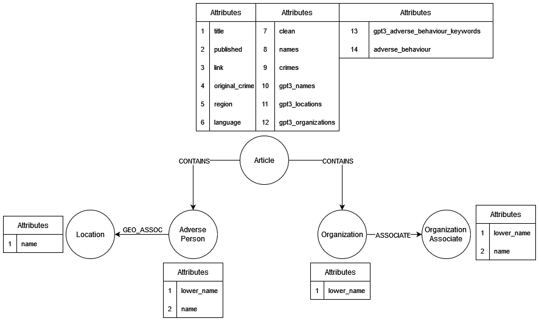

# ams-service

Allows user to search adverse entities in our ams data and also display detailed information about them.

## OpenAPI specification
https://app.swaggerhub.com/apis/ykbhlvck/adversea-ams-service/1.0.0

## How to run
* python3 -m venv ./venv
* source ./venv/bin/activate
* pip install -r requirements.txt
* add parsed_articles_sk_merged_2018_2019 to root folder
* make sure your neo4j is running
* use env variables according to settings.py for successfull connection to neo4j
* python3 ./data_loader.py
* python3 ./app.py

# Routes
* `/adverse-entity/search?name=<name-value>`
* `/adverse_entity/detail?name=<name-value>`
* `/suspicious-associations/search?name=<name-value>&count=<integer>`

## Examples
* `/adverse_entity/search?name=Marian Kocner`
* `/adverse_entity/detail?name=Marian Kocner`
* `/suspicious-associations/search?name=Marian Kocner&count=5`

# Database model

